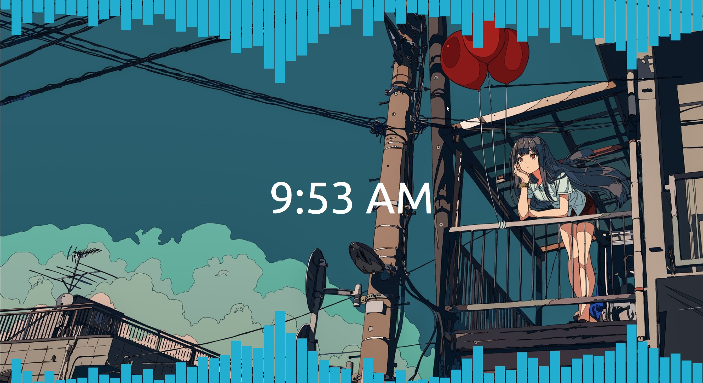

# Wallpaper

This is the wallpaper with live audio visualizers I use for Wallpaper Engine.

## Requirements

- Wallpaper Engine (Steam)
- NodeJS
- NPM

## Setup

- Clone the repo
- Run `npm install`
- Run `npx webpack`
- Open Wallpaper Engine
- Open the newly generated `dist/project.json` file as your wallpaper

## License

MIT License